# 使用Termux搭建桌面级生产力环境

这篇教程用于在Android设备上利用Termux搭建桌面级生产力环境

[观看视频教程](https://www.bilibili.com/video/BV15J4m1g7MW/)

# 效果展示

- 使用LibreOffice编辑文字、表格和演示文稿
  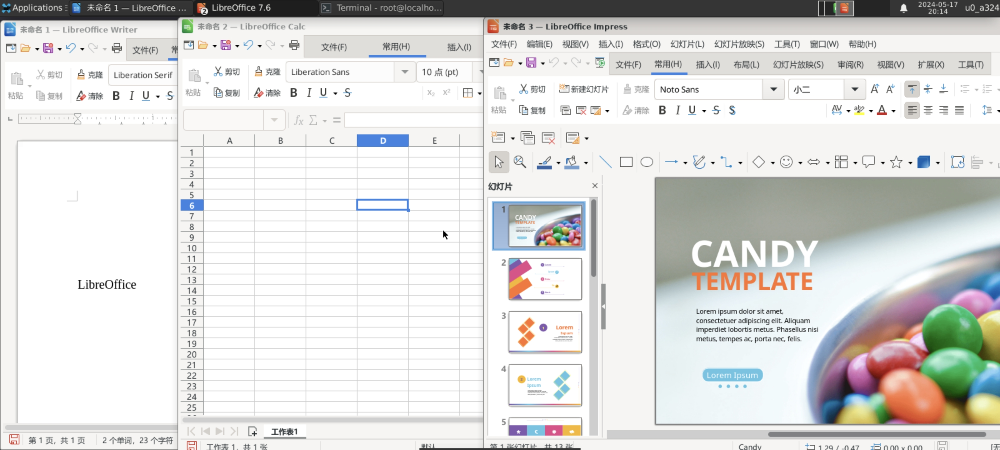
- 使用VSCode进行开发
  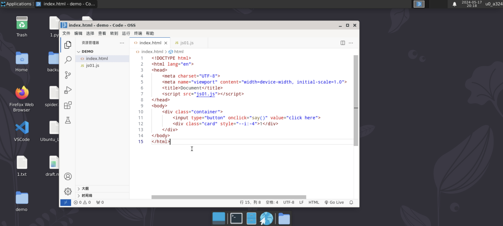
- 使用Photoshop进行平面设计
  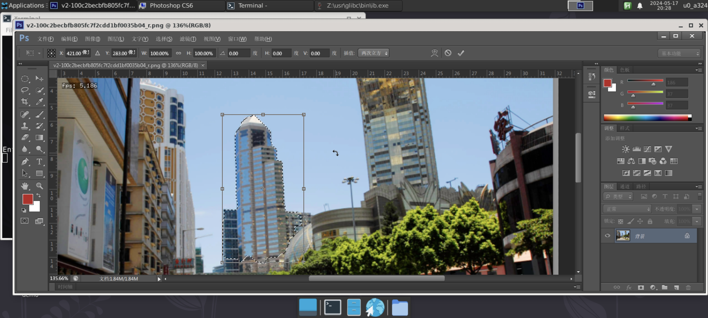
- 使用Blender进行三维建模
  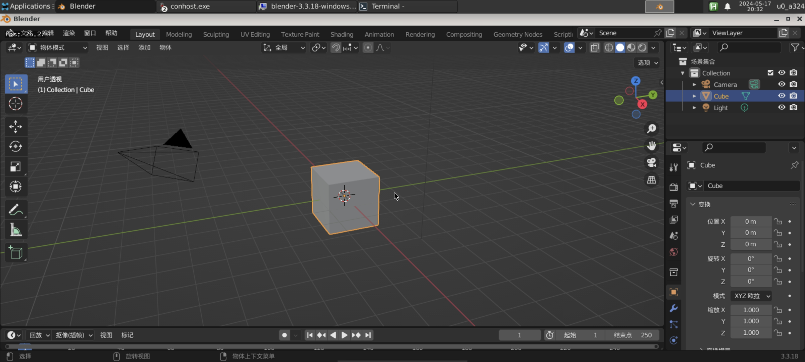
- 桌面级网页浏览
  
- 玩玩小游戏
  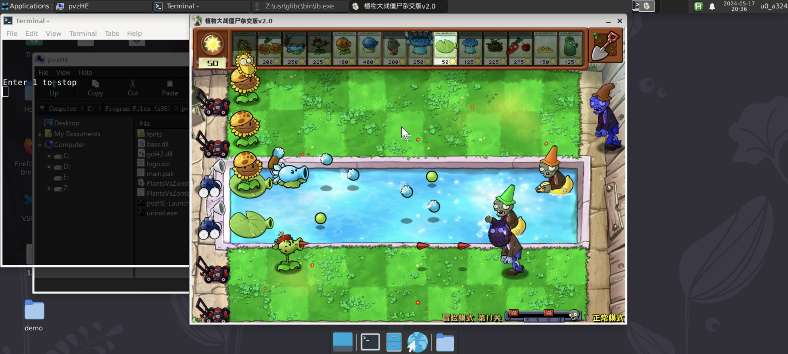

# 原则

本教程将会通过层次明确的步骤讲解，以便理解，如果你具有Linux基础知识，可能会更容易理解这里的内容；没有也没关系，我尽量讲解细致、全面一些

不会使用类似**TMOE全能**那样的一键部署工具，而是带着你逐步自己完成各个步骤

如果你嫌麻烦的话，也可以用其他人制作的一键恢复包

# 先决条件

- 一部**安卓**手机，安装：
  - Termux
  - Termux:x11
  - VNC Viewer (可选，作为代替x11的另一种连接方式)
  - Input Bridge (可选，Mobox推荐的按键映射控制器)
- 键鼠外设 (可选,便于桌面级环境操作)
- 足够的**耐心**

> **提示：** 不推荐使用ZeroTermux,Utermux之类的魔改版Termux以防出现不可预测的问题

# 一、下载与安装Termux

Termux的**官方**下载途径为[F-Droid](https://f-droid.org/packages/com.termux/)，若无法访问官网，也可从其他途径获取安装包

## Why Termux

Termux作为一个终端模拟器，提供了一个开箱即用的模拟的Linux环境，这意味着你可以用使用Linux的方式使用它，强大的第三方包也是其特色之一

## Tips

尽管Termux能模拟Linux环境，但它与真正的Linux还是存在不同，详见[Termux Wiki](https://wiki.termux.com/wiki/Differences_from_Linux)

顺带一提它不是虚拟机，这意味着你如果在里面玩 `rm -rf / *`，你还是会有<span style="color:red;">数据丢失</span>的风险

# 二、安装桌面环境

## (可选)换源

由于需要从Termux的软件仓库下载软件包，而国内的网络访问情况似乎不太明朗，所以可以使用 `termux-change-repo`将下载源换为清华源

> 你也可以选择使用网络代理来加快访问速度

## 了解apt

apt全称***Advanced Packaging Tool***是基于Debain的Linux发行版上的软件包管理工具，也是Termux所使用的软件包管理工具，在本教程中将会多次使用

```
提示: apt的常用命令如下
apt update：更新本地包数据库，获取最新的软件包信息。
apt upgrade：升级所有已安装的软件包到最新版本。
apt install [package]：安装指定的软件包。
apt remove [package]：移除指定的软件包。
apt purge [package]：移除指定的软件包并清除其配置文件。
apt search [package]：搜索软件包。
apt list --installed：列出所有已安装的软件包。
apt autoremove：自动移除不再需要的依赖包。
apt autoclean：清理旧的下载的软件包文件。
apt clean：清理所有的下载的软件包文件。
```

你可能会觉得命令太多记不住，其实你可以使用***新立得软件包管理器***(Synaptic)作为apt图形化前端代替命令，不过大多数时候还是推荐使用命令操作

## 安装xfce4桌面

1. 使用 `apt update`更新软件包信息

> **提示：** 因为apt的搜索和下载功能都是基于本地包数据库进行操作，如果软件包信息未更新会导致你无法搜索与下载到相应的软件包

2. 使用 `apt search x11-repo`，如果能看见屏幕上以绿色字体输出**x11-repo**结果，则表示操作正确，接下来便可以使用 `apt install x11-repo`下载与安装x11软件仓库

> **提示：** 我们将要从x11软件仓库下载xfce4桌面环境，因此安装x11-repo是必须的；此外，你同样可以对x11-repo使用 `termux-change-repo`执行换源操作

3. 使用 `apt search xfce4`搜索软件包，你会看见很多个包含xfce4的结果，我们将要安装的是其中的xfce4，使用 `apt install xfce4`进行安装

> **提示：** xfce4的描述是组成xfce桌面环境所有组件的元软件包，如果你使用 `apt show xfce4`命令会发现在Depends包含了很多软件包，因此安装了xfce4就相当于安装了它的所有组件

## 安装x11服务器

1. 从Termux-x11的[Github Actions](https://github.com/termux/termux-x11/actions/workflows/debug_build.yml)页面获取Termux-x11的安装包下载并安装

> **提示：** X Window Server简称x11，是各类GUI程序与你进行交互的媒介

2. 使用以下命令安装x11服务器

```
apt install termux-x11-nightly
```

## 启动桌面环境

1. 使用以下命令开启虚拟显示器

```
termux-x11 :0 &>/dev/null &
```

**提示：**

- termux-x11命令使用的前提是你得先安装Termux-x11 APP
- :0表示指定的显示编号，在此设置为0即可
- &>/dev/null表示将标准输出和错误输出都重定向到/dev/null，这个特殊文件称为黑洞，即不显示输出信息
- 末尾的&可让命令在后台执行而不阻塞终端

2. 使用以下命令设置环境变量

```
export DISPLAY=:0
```

**提示：**

- **export** 用于将变量设置导出到当前shell环境子进程中，用法为 `export [变量名]=[值]`
- **DISPLAY**变量用于控制“在哪里绘制和显示图形界面”

3. 使用以下命令启动xfce4桌面

```
startxfce4
```

> **提示：** 如果遇到CANNOT LINK EXECUTABLE "xfce4-session": library "libexpat.so.1" not found: needed by /data/data/com.termux/files/usr/lib/libfontconfig.so in namespace (default)错误，可尝试使用命令 `apt install libexpat`解决

4. 切换到Termux:x11，你现在应该能正常看见桌面环境了
   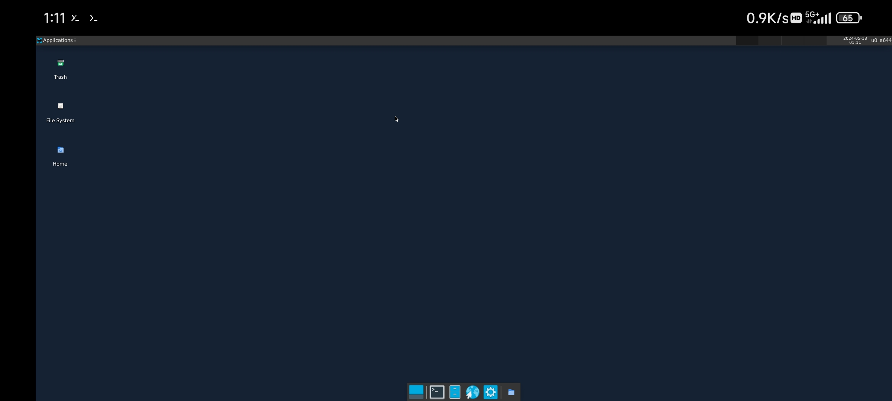
5. 设置Termux:x11

- 你可以通过**长按**Termux:x11的图标并点弹出菜单内的**Preferences**打开首选项设置页面，也可在**未启动x11时**打开APP点页面上的**Preference**进入设置页
- 可以在里面设置**屏幕分辨率，切换横竖屏，显示功能键盘，隐藏屏幕刘海**等等

## (可选)搭建VNC服务器

相对于x11，VNC更方便通过其他设备远程连接

1. 安装VNC服务器

```
apt install tigervnc
```

2. 启动VNC服务器

```
vncserver :1 -localhost no
```

> **提示：** `-localhost no`用于允许网络上的其他设备连接

首次启动会要求你设置VNC的连接密码，输出信息如下

```
You will require a password to access your desktops.

Password:  #此处输入密码
Verify:    #再次确认密码
Would you like to enter a view-only password (y/n)? n  #不需要设置View-only密码,输入n
```

3. 输出以下信息代表操作正确

```
New 'localhost:1 ()' desktop is localhost:1

Creating default startup script /data/data/com.termux/files/home/.vnc/xstartup
Creating default config /data/data/com.termux/files/home/.vnc/config
Starting applications specified in /data/data/com.termux/files/home/.vnc/xstartup
Log file is /data/data/com.termux/files/home/.vnc/localhost:1.log
```

> **提示：** VNC的配置信息将保存在 `~/.vnc`中，你可能需要显示隐藏文件才能看见它

4. 设置环境变量

```
export DISPLAY=:1
```

5. 使用**VNC Viewer**连接到 `127.0.0.1:5901`即可进入桌面环境，或在同一网络环境下使用IPv4地址进行连接

# 三、Termux后台保活

## 关于Phantom Processes Killing

在 Android 12 中引入了一个名为**Phantom Processes Killing**(影子进程杀手)的机制，该机制将监视应用程序派生的子进程，并在达到**32个以上子进程**时将其终止，以避免占用过多的CPU资源

Termux中的所有程序都属于Termux的子进程，如果你使用xfce的**任务管理器**(使用 `apt install xfce4-taskmanager`安装)查看进程数，就会发现当进程数大于32时Termux:x11的画面将大概率忽然断开，并且在Termux输出 `Process completed(signal 9)`的信息

> **提示：** 进程之间可以以树形关系表示

## 关闭Phantom Processes Killing

通常使用ADB的方法关闭Phantom Processes Killing机制，不过HyperOS有更方便的方法关闭它，在手机设置的开发者选项页面开启**停止限制子进程**即可
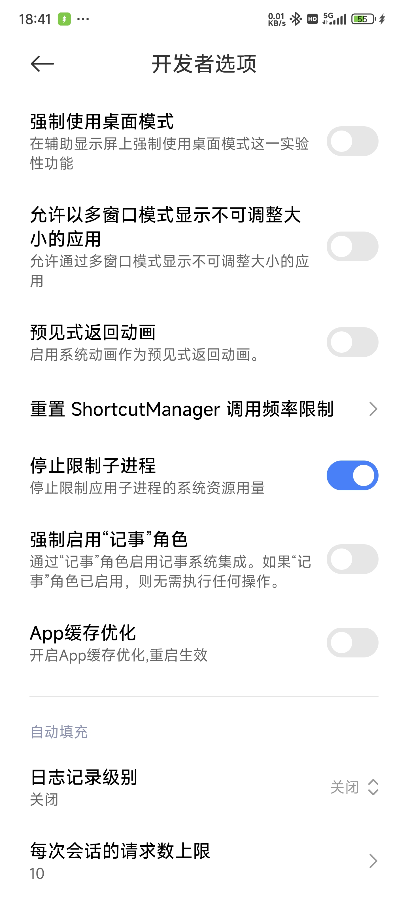

## 关闭省电优化

如果未关闭省电优化，Termux在后台运行的优先级会被降低，可能导致程序卡顿或无法正常工作，例如code-server可能连接不上

在应用详情页将省电策略改为**无限制**

# 四、编写桌面启动脚本

由于每次启动桌面环境，我们都需要**重复**以上的1~3步骤，因此可以写一个启动脚本来简化启动步骤，**选择**以下任一方法编写启动脚本即可，两个方法是等价的

## 方法一:使用图形化界面

1. 如果你还没安装文本文件编辑器，打开终端模拟器，使用以下命令安装Mousepad

```
apt install mousepad -y
```

2. 打开文件管理器，在导航栏输入 `$PATH`导航到目录
   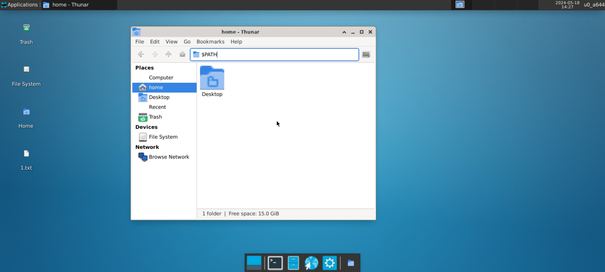

> **提示**：Termux的PATH环境变量默认只包含/data/data/com.termux/files/usr/bin/这一个值，因此你可以使用环境变量代替路径名快速导航过去

3. 在空白处右键选择 `Create Document`->`Empty File`创建新文件，取名为 `startx11`，使用Mousepad打开它，并输入以下内容并保存

```
#!/bin/bash

export DISPLAY=:0
termux-x11 :0 -xstartup "dbus-launch --exit-with-session xfce4-session" &>/dev/null &
am start --user 0 -n com.termux.x11/.MainActivity &>/dev/null
```

> **提示**：关于Shell编程可通过其他教程学习，例如[菜鸟教程](https://www.runoob.com/linux/linux-shell.html)

4. 右键该文件选择 `Properties...`在打开的属性窗口切换到 `Permissons`栏并勾选下面的 `Allow this file to run as a program`添加执行权限
   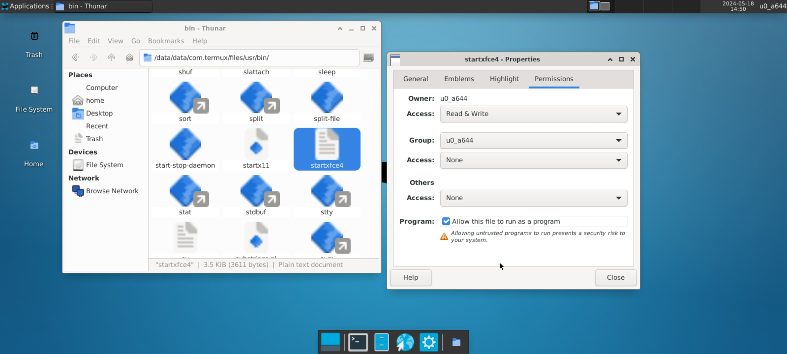

## 方法二:使用终端

1. 切换到PATH目录

```
cd $PATH
```

2. 创建文件

```
nano startx11
```

3. 输入以下内容

```
#!/bin/bash

export DISPLAY=:0
termux-x11 :0 &>/dev/null &
sleep 3
startxfce4 &>/dev/null &
am start --user 0 -n com.termux.x11/.MainActivity &>/dev/null
```

4. 使用 `Ctrl+O`触发保存，确定写入的文件名为 `startx11`按回车继续，然后使用 `Ctrl+X`退出文本编辑器
5. 使用以下命令为脚本添加执行权限

```
chmod +x startx11
```

完成以上步骤即可随时使用 `startx11`命令启动桌面环境

> **提示**：在Windows系统中我们通常使用.exe后缀分辨文件为一个可执行程序，但在Linux中文件能否执行由它本身的执行权限属性决定

## (可选)编写VNC启动脚本

1. 安装xorg-xhost

```
apt install xorg-xhost
```

2. 导航到PATH目录

```
cd $PATH
```

3. 创建文件

```
nano startvnc
```

4. 输入以下内容

```
#!/bin/bash

vncserver :1 -localhost no -geometry 1280x720
wait
export DISPLAY=:1
xhost +
sleep 1
startxfce4
```

5. 使用 `Ctrl+O`触发保存，确定写入的文件名为 `startvnc`按回车继续，然后使用 `Ctrl+X`退出文本编辑器
6. 使用以下命令为脚本添加执行权限

```
chmod +x startvnc
```

完成以上步骤即可随时使用 `startvnc`命令启动桌面环境

# 五、安装Mobox

Mobox集成了一系列在安卓设备上转译运行Windows软件的工具，使得你可以跨平台转译运行它们

> **提示：** Mobox的图形驱动对**高通骁龙**系列的处理器适配效果更好，其他例如天玑、麒麟等系列处理器图形性能可能不会很强

## 确保网络正常访问

由于 `raw.githubusercontent.com`域名在国内通常难以访问，考虑使用网络代理或其他方式安装，否则将会安装失败

## 安装Mobox

如果你还停留在桌面环境，你可以选择使用xfce的**终端模拟器**进行安装，也可以选择**Log off**注销桌面环境回到Termux进行安装

使用以下命令进行安装

```
curl -s -o ~/x https://raw.githubusercontent.com/olegos2/mobox/main/install && . ~/x
```

安装过程可能会询问你要安装Box86还是Box64，这里推荐Box64，输入 `2`并回车继续

## 启动Mobox

在安装完成后可以使用命令 `mobox`启动Mobox，使用方向键可以移动选择光标，选择 `Start Wine`并回车继续，如果出现了Wine的桌面则说明操作正确

如果你在桌面环境启动Mobox，你可能会注意到Wine的桌面将xfce桌面覆盖了，这将是接下来要解决的问题

# 六、设置Mobox

为了让Mobox使用xfce的窗口管理器，我们将对Mobox的启动脚本进行修改

如果你还留在**Wine桌面**(不是指Xfce桌面)中，使用Start菜单中的 `shutdown`选项退出Mobox

## 备份

找到位于 `/data/data/com.termux/files/usr/glibc/opt/scripts`路径下的 `start-tfm`文件，为了方便恢复，把它拷贝一份到容易找到的地方，例如 `~/origin/`(~代表home目录)

在**图形化界面**下直接右键该文件选 `Copy`，去到 `Home`目录再右键创建文件夹 `origin`，再右键 `Paste`进行粘贴

## 修改

打开原本的 `start-tfm`文件，搜索 `stop-all`，将位于文件首尾两个单独成行的 `stop-all`前加入 `#`符号注释掉它

搜索 `explorer /desktop=shell,$RESOLUTION`，你应该会搜索到四个符合的地方，删掉后面三处完全匹配的部分

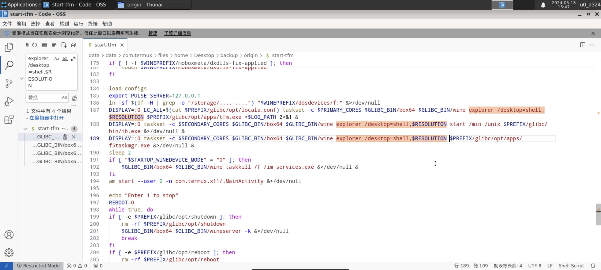

完成修改后，当你再次启动Mobox，就能发现它的窗口与xfce桌面融合在一起了

在这之后如果想**恢复/修改**的话，将**start-tfm**文件与之前备份的文件互换即可

> **提示：** 假如你只是想使用Mobox玩玩游戏而不需要使用Linux环境的话，就可以把修改后文件移出来，备份的原文件放回原位，直接使用Termux启动带桌面的Wine，这样可以节省性能开销提高运行效率

# 七、(可选)直接安装常用软件

## 火狐浏览器

火狐浏览器在**x11-repo**软件仓库有提供，可以通过以下命令安装

```
apt install firefox
```

安装后你可以通过xfce的 `Application`菜单找到它，也可以在终端输入 `firefox`启动

## Visual Studio Code

VSCode在Termux上并没有官方发行版，不过可以使用另一个基于VSCode的开源项目**Code - OSS**进行代替

**Code - OSS**由**tur-repo**仓库提供，需要先安装**tur-repo**，通过以下步骤安装

```
apt install tur-repo
apt install code-oss
```

## Chromium

来自**tur-repo**

```
apt install chromium
```

## Clang

```
apt install clang
```

## Code::Blocks

来自**x11-repo**

```
apt install codeblocks
```

## Code Server

来自**tur-repo**

```
apt install code-server
```

## 局限性

可以安装和使用的软件较少，因此与Mobox互相补全软件生态

# 八、(可选)Mobox安装常用软件

## 文件位置

在启动Mobox后将会自动打开一个**文件管理器**(tfm)，其中的 `D:`盘被映射到**安卓的文件下载目录**，即 `/sotrage/emulated/0/Download/`目录，这样比较方便的一点是，如果你用安卓系统自带的浏览器去下载程序并且不修改下载路径，下载的文件通常都能在Mobox的 `D:`盘中找到

Mobox的 `Z:`盘被映射到Termux中的**Linux的根目录**，而你也可以在xfce环境中的浏览器例如Firefox中下载程序，通常会被下载到 `~/Downloads/`里面，这意味着你可以在Mobox中的 `Z:/home/Downloads/`中找到自己下载的文件

## 找到安装软件的软件并运行

在安装时可以展开安装程序看一下**安装的路径**方便寻找，通常是 `C:\Program Files (x86)`或 `C:\Program Files`里面能找到安装的程序

例如 Photoshop CS6 就安装在 `C:\Program Files (x86)\Adobe\Photoshop CS6\`，可以通过其中的 `Photoshop.exe`启动

## 免安装软件直接运行

例如**Blender Portable**就可直接找到下载的文件，打开里面的 `Blender.exe`直接启动

## 局限性

Wine 转译的**兼容性较差**，很多软件都无法正常运行，例如 `Microsoft Office 2010`就无法运行，因此与Linux环境互相补全软件生态
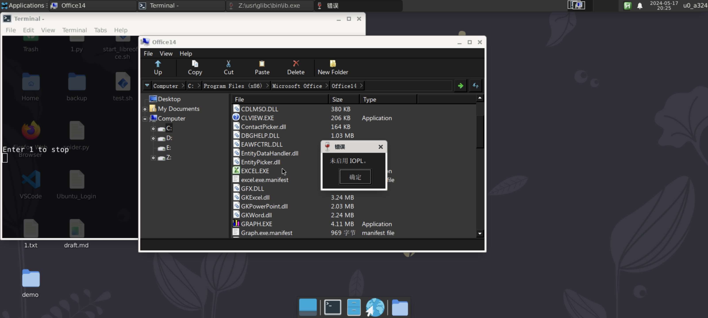


# 九、(可选)PRoot安装常用软件

## 关于PRoot

正如[Termux Wiki](https://wiki.termux.com/wiki/Differences_from_Linux)提到的那样，Termux模拟的Linux环境与真实的Linux环境有很多差别，这导致了很多软件都不能在这上面运行

实际上，在此之前直接安装在Termux上的软件都能理解为**针对Termux特别修改适配**的版本，相当于修改了软件需要使用FHS文件系统，多用户，GLIBC库等等部分，才得以适配Termux与真正Linux环境的差异

而PRoot能进一步模拟一个更完善的Linux环境，从而做到Termux做不到的事，兼容更多的软件运行

## 使用PRoot安装Linux发行版

先使用以下命令安装上proot-distro

```
apt install proot proot-distro
```

> **提示：** proot-distro用于安装和管理不同的Linux发行版，可以使用命令 `proot-distro --help`查看它的用法

列出可用的发行版

```
proot-distro list
```

你应该能看见它输出了很多个Linux发行版供选择，如果要安装哪个发行版，就记住它的Alias并使用命令 `proot-distro install <alias>`安装它，例如我选择的是**Debian (bookworm)**，它在列表中的Alias为**debian**，因此使用以下命令安装

```
proot-distro install debian
```

## 登录Linux发行版

安装完成后使用以下命令登录

```
proot-distro login debian
```

> **提示：** 如果你用 `whoami`命令会输出 `root`，这表示登录到PRoot的Linux发行版时，默认是以root用户登录的，当然你也可以新建并切换到其他用户

查看系统信息(若未安装neofetch使用`apt install neofetch`安装)

```
neofetch
```

输出结果与直接在Termux中运行效果对比，很明显表示它已经将你的系统识别为Debian了

> **提示：** 登录了PRoot中的Linux发行版后，你也许不能使用直接安装在Termux中的程序，或程序表现不像在Termux中直接启动那样，这与PRoot本身的特点有关，意味着它不能直接访问到PRoot外的相关文件，而是被重定向到了其他位置；视觉上就像它们相互独立一样

## 让PRoot识别你的x11

对比PRoot内外的信息不难发现，PRoot外能正常识别出**桌面环境和分辨率**但PRoot内不能，这意味着在PRoot内启动图形化的程序它是无法正常显示在屏幕上的

要解决这个问题，首先注销PRoot中的登录

```
exit
```

在登录命令后面加上 `--shared-tmp`参数再登录

```
proot-distro login debian --shared-tmp
```

登录后设置**DISPLAY环境变量**来告诉系统你想在哪显示界面

```
export DISPLAY=:0
```

这时再执行 `neofetch`就能看见它也能正常识别桌面环境了

> **提示：** 如果是用VNC服务器启动的桌面，则需要确保在PRoot外执行 `xhost +`命令进行显示授权，这在之前的步骤中已经写进启动脚本中了，同时把显示编号改为之前设置的1，即 `export DISPLAY=:1`

## 安装LibreOffice

更新软件包信息

```
apt update
```

安装LibreOffice

```
apt install libreoffice
```

启动LibreOffice

```
libreoffice
```

进入设置页，切换界面为中文

## 安装中文字体

LibreOffice上面的所有中文字体都以方块显示，这说明缺少中文字体，从Windows系统上将字体复制到 `~/.fonts/`中即可

> **提示：** PRoot的 `~/.fonts/`相对Termux来说位于 `/data/data/com.termux/files/usr/var/lib/proot-distro/installed-rootfs/debian/root/.fonts/`

## 创建启动器

打开终端使用proot-distro登录到Debian，设置DISPLAY变量，输入脚本名启动LibreOffice...

由于每次启动LibreOffice都需要经过上述**繁琐步骤**，因此我们来创建一个启动器**简化启动**步骤

在桌面上右键选择`Create Launcher...`来创建一个启动器，起名为LibreOffice，在**命令栏**填入以下内容

```
proot-distro login debian --shared-tmp -- sh -c 'export DISPLAY=:0 && libreoffice'
```

此后就能通过此启动器直接启动LibreOffice了

## (可选)安装QQ

进入[QQ下载页](https://im.qq.com/linuxqq/)选择**ARM版下载**，选择**deb格式**安装包进行下载

登录debian，使用拖拽自动补全安装包路径

```
dpkg -i QQ_3.2.7_240428_arm64_01.deb
```

修复依赖

```
apt install -f
```

修复完再次安装

```
dpkg -i QQ_3.2.7_240428_arm64_01.deb
```

启动QQ

```
qq --no-sandbox
```

> **提示：** **Q:** 既然从PRoot里面启动应用这么麻烦，为什么不把XFCE装在PRoot内呢? **A:** 把XFCE装在PRoot确实为更普遍的选择，包括如果你用TMOE全能安装桌面环境的话，它也会帮你把XFCE装在PRoot中。但是这里为了**兼容Mobox**，因为Mobox的前身是termux-box，也用上了PRoot，但其作者选择新开一个仓库改名为Mobox，不再使用PRoot而换成glibc-packages肯定是有原因的，如果再把Mobox装回PRoot中就有点本末倒置的感觉了


## 问题描述
我按照上面的教程安装proot Ubuntu后使用termux:x11登陆termux native图形界面xfce4， 所用命令如下：
```
#!/bin/bash
export DISPLAY=:0
termux-x11 :0 &>/dev/null &
sleep 1
openbox-session &
startxfce4 &>/dev/null &
```
界面如图：
  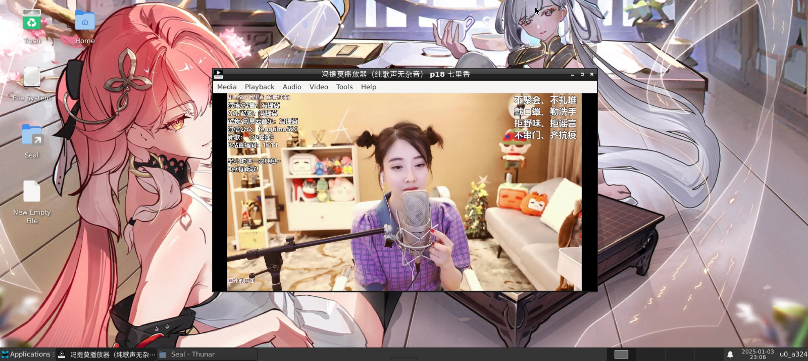
接着使用命令打开qq
```
proot-distro login ubuntu --shared-tmp -- sh -c 'export DISPLAY=:0 && qq --no-sandbox'
```
如图，可以正常登录并使用qq
  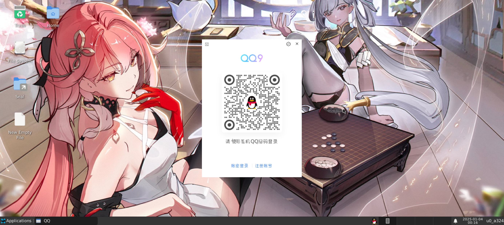

然后把termux关了，打开vnc，脚本命令如下：
```
#!/bin/bash
vncserver :1 -localhost no -geometry 1600x720
wait
export DISPLAY=:1
xhost +
sleep 1
#openbox-session &
startxfce4 &>/dev/null &
```

然后打开qq：
```
proot-distro login ubuntu --shared-tmp -- sh -c 'export DISPLAY=:1 && qq --no-sandbox'
```

出现如下报错：
```
~ $ proot-distro login ubuntu --shared-tmp -- sh -c 'export DISPLAY=:1 && qq --no-sandbox'
version_config_filename :/root/.config/QQ/versions/config.json
app_package_filename :/resources/app/package.json
config_build_id :30899
config_base_version :3.2.15-30899
config_current_version :3.2.15-30899
app_build_version :
version_config_filename :/root/.config/QQ/versions/config.json
version_config_filename :/root/.config/QQ/versions/config.json
app_package_filename :/opt/QQ/resources/app/package.json
app_package_filename :/opt/QQ/resources/app/package.json
config_build_id :30899
config_base_version :3.2.15-30899
config_current_version :3.2.15-30899
app_build_version :30899
config_build_id :30899
config_base_version :3.2.15-30899
config_current_version :3.2.15-30899
app_build_version :30899
[preload] succeeded. /opt/QQ/resources/app/major.node
[preload] succeeded. /opt/QQ/resources/app/major.node
[22344:0104/095248.344603:ERROR:bus.cc(407)] Failed to connect to the bus: Failed to connect to socket /run/dbus/system_bus_socket: No such file or directory
Authorization required, but no authorization protocol specified

[22344:0104/095248.538530:ERROR:ozone_platform_x11.cc(245)] Missing X server or $DISPLAY
[22344:0104/095248.538574:ERROR:env.cc(258)] The platform failed to initialize.  Exiting.
Segmentation fault

```

请问怎么解决？